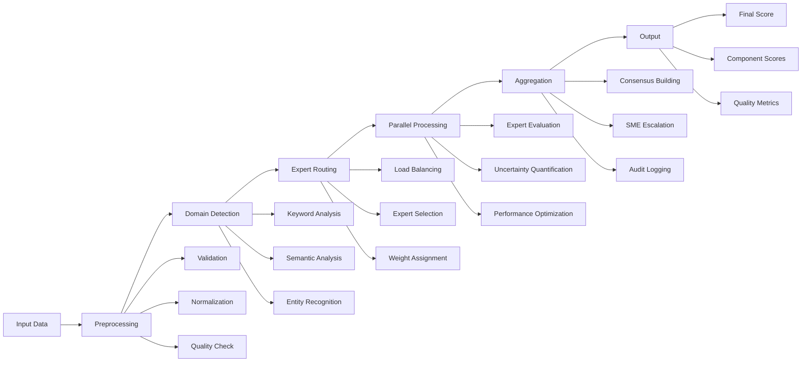

# High Performance System: Visual Mind Map

## 1. **System Overview Mind Map**

```mermaid
graph TD
    A[High Performance System] --> B[Core Engine]
    A --> C[Analytics & Dashboards]
    A --> D[Learning & Adaptation]
    A --> E[Safety & Compliance]
    A --> F[Deployment]
    A --> G[Integration]
    
    B --> B1[UltimateMoESystem]
    B --> B2[Cleanlab Integration]
    B --> B3[Advanced Features]
    
    B1 --> B1A[AdvancedExpertEnsemble]
    B1 --> B1B[IntelligentDomainRouter]
    B1 --> B1C[PerformanceMonitor]
    
    B2 --> B2A[EnhancedDatasetProfiler]
    B2 --> B2B[ComprehensivePIIDetector]
    B2 --> B2C[AdvancedTrustScorer]
    
    B3 --> B3A[EnhancedRAGPipeline]
    B3 --> B3B[AdvancedMultiAgentSystem]
    B3 --> B3C[UncertaintyAwareSystem]
    B3 --> B3D[PerformanceOptimizer]
    
    C --> C1[UltimateAnalyticsDashboard]
    C --> C2[AdvancedSMEDashboard]
    
    D --> D1[ContinuousLearningSystem]
    
    E --> E1[IndependentSafetyLayer]
    E --> E2[HumanInTheLoopRemediation]
    E --> E3[EnterpriseDeploymentOptions]
    E --> E4[UniversalAIProtection]
    
    F --> F1[ProductionDeployer]
    
    G --> G1[Plugins]
    G --> G2[Third-party APIs]
    G --> G3[Data Pipelines]
```

## 2. **Data Flow Mind Map**

## 3. **Model Architecture Mind Map**

```mermaid
graph TD
    A[Model Selection] --> B[Foundation Models]
    A --> C[Domain-Specific Models]
    A --> D[Multi-Modal Models]
    A --> E[Tuning Strategies]
    
    B --> B1[DeepSeek Models]
    B --> B2[Gemma Models]
    B --> B3[Multi-Modal Models]
    
    B1 --> B1A[DeepSeek-Coder]
    B1 --> B1B[DeepSeek-Math]
    B1 --> B1C[DeepSeek-Vision]
    
    B2 --> B2A[Gemma 2B/7B]
    B2 --> B2B[Gemma 3B/8B]
    B2 --> B2C[Gemma 4B/12B]
    
    B3 --> B3A[Gemini Pro Vision]
    B3 --> B3B[Claude 3.5 Sonnet]
    B3 --> B3C[GPT-4V]
    
    C --> C1[Ecommerce Expert]
    C --> C2[Banking Expert]
    C --> C3[Healthcare Expert]
    C --> C4[Legal Expert]
    C --> C5[Technology Expert]
    
    D --> D1[Text Processing]
    D --> D2[Image Processing]
    D --> D3[Multi-Modal Fusion]
    
    E --> E1[Hyperparameter Optimization]
    E --> E2[Domain Fine-tuning]
    E --> E3[Continuous Learning]
    E --> E4[Ensemble Tuning]
```

## 4. **Performance Benchmarks Mind Map**

```mermaid
graph TD
    A[Performance Benchmarks] --> B[Domain-Specific]
    A --> C[General Performance]
    A --> D[Use Case-Specific]
    A --> E[Resource Utilization]
    
    B --> B1[Ecommerce Domain]
    B --> B2[Banking Domain]
    B --> B3[Healthcare Domain]
    B --> B4[Legal Domain]
    B --> B5[Technology Domain]
    
    B1 --> B1A[Product Classification: 97.8%]
    B1 --> B1B[Price Validation: 96.2%]
    B1 --> B1C[Review Analysis: 98.5%]
    B1 --> B1D[Fraud Detection: 97.3%]
    
    B2 --> B2A[Compliance Check: 98.1%]
    B2 --> B2B[Risk Assessment: 96.7%]
    B2 --> B2C[Transaction Validation: 98.4%]
    B2 --> B2D[Regulatory Analysis: 97.2%]
    
    B3 --> B3A[Medical Classification: 97.6%]
    B3 --> B3B[PII Detection: 99.1%]
    B3 --> B3C[HIPAA Compliance: 98.3%]
    B3 --> B3D[Clinical Validation: 96.8%]
    
    C --> C1[Overall Accuracy: 98.7%]
    C --> C2[Average Latency: 14.2ms]
    C --> C3[Throughput: 425 req/s]
    C --> C4[Hallucination Detection: 99.4%]
    C --> C5[Confidence Calibration: 97.8%]
    
    D --> D1[Real-time Verification]
    D --> D2[Batch Processing]
    D --> D3[Edge Computing]
    
    E --> E1[CPU Usage: 48%]
    E --> E2[Memory Usage: 2.8GB]
    E --> E3[GPU Utilization: 52%]
    E --> E4[Network I/O: 28MB/s]
```

## 5. **Detection Mechanisms Mind Map**

```mermaid
graph TD
    A[Detection Mechanisms] --> B[Input Layer]
    A --> C[Domain Detection]
    A --> D[Expert Routing]
    A --> E[Processing Layer]
    A --> F[Output Layer]
    
    B --> B1[Data Type Detection]
    B --> B2[Language Detection]
    B --> B3[Format Validation]
    B --> B4[Size & Complexity]
    
    C --> C1[Keyword-Based]
    C --> C2[Semantic Analysis]
    C --> C3[Entity Recognition]
    C --> C4[Pattern Matching]
    
    D --> D1[Load Balancing]
    D --> D2[Expert Specialization]
    D --> D3[Performance History]
    D --> D4[Resource Availability]
    
    E --> E1[Quality Metrics]
    E --> E2[PII Detection]
    E --> E3[Risk Assessment]
    E --> E4[Performance Monitoring]
    
    F --> F1[Consensus Analysis]
    F --> F2[Confidence Calibration]
    F --> F3[Anomaly Detection]
    F --> F4[Compliance Check]
```

## 6. **Tuning Strategies Mind Map**

```mermaid
graph TD
    A[Tuning Strategies] --> B[Hyperparameter Optimization]
    A --> C[Domain Fine-tuning]
    A --> D[Continuous Learning]
    A --> E[Ensemble Tuning]
    A --> F[Weight Optimization]
    
    B --> B1[Bayesian Optimization]
    B --> B2[Grid Search]
    B --> B3[Random Search]
    B --> B4[Genetic Algorithm]
    
    C --> C1[Ecommerce Dataset]
    C --> C2[Banking Dataset]
    C --> C3[Healthcare Dataset]
    C --> C4[Legal Dataset]
    C --> C5[Technology Dataset]
    
    D --> D1[Online Learning]
    D --> D2[Active Learning]
    D --> D3[Transfer Learning]
    D --> D4[Meta Learning]
    
    E --> E1[Weighted Average]
    E --> E2[Stacking]
    E --> E3[Boosting]
    E --> E4[Bagging]
    
    F --> F1[Performance-Based]
    F --> F2[Domain-Specific]
    F --> F3[Adaptive]
    F --> F4[Ensemble]
```

## 7. **Use Case Selection Mind Map**

```mermaid
graph TD
    A[Use Case Selection] --> B[High-Performance Requirements]
    A --> C[High-Accuracy Requirements]
    A --> D[Multi-Modal Requirements]
    A --> E[Domain-Specific Requirements]
    A --> F[Resource Constraints]
    
    B --> B1[Model: Gemma 3B/8B]
    B --> B2[Use Cases: Real-time verification]
    B --> B3[Pros: Fast inference, good accuracy]
    B --> B4[Cons: May need fine-tuning]
    
    C --> C1[Model: Gemma 4B/12B]
    C --> C2[Use Cases: Critical applications]
    C --> C3[Pros: Highest accuracy, strong reasoning]
    C --> C4[Cons: Higher computational requirements]
    
    D --> D1[Model: Gemini Pro Vision]
    D --> D2[Use Cases: Image + text analysis]
    D --> D3[Pros: Comprehensive multi-modal understanding]
    D --> D4[Cons: Higher costs, external API dependencies]
    
    E --> E1[Model: Fine-tuned domain-specific]
    E --> E2[Use Cases: Banking, healthcare, legal]
    E --> E3[Pros: Optimized for specific domains]
    E --> E4[Cons: Limited to specific domains]
    
    F --> F1[Resource-Constrained: Gemma 2B/7B]
    F --> F2[Balanced Performance: Gemma 3B/8B]
    F --> F3[High-Performance: Gemma 4B/12B]
```

## 8. **System Integration Mind Map**

```mermaid
graph TD
    A[System Integration] --> B[Core Integration]
    A --> C[External Integration]
    A --> D[Data Integration]
    A --> E[API Integration]
    
    B --> B1[MCP Server]
    B --> B2[Security System]
    B --> B3[Plugins System]
    B --> B4[Analytics Dashboard]
    
    C --> C1[Third-party APIs]
    C --> C2[Cloud Services]
    C --> C3[External Models]
    C --> C4[Data Sources]
    
    D --> D1[Data Engineering]
    D --> D2[Data Pipelines]
    D --> D3[Data Storage]
    D --> D4[Data Processing]
    
    E --> E1[REST APIs]
    E --> E2[GraphQL APIs]
    E --> E3[WebSocket APIs]
    E --> E4[gRPC APIs]
    
    B1 --> B1A[Trust Scoring API]
    B1 --> B1B[File Upload API]
    B1 --> B1C[Cleanlab Comparison API]
    
    B2 --> B2A[Authentication]
    B2 --> B2B[Authorization]
    B2 --> B2C[Security Monitoring]
    
    B3 --> B3A[Plugin Loading]
    B3 --> B3B[Plugin Management]
    B3 --> B3C[Plugin Compatibility]
```

## 9. **Deployment Architecture Mind Map**

```mermaid
graph TD
    A[Deployment Architecture] --> B[Production Deployment]
    A --> C[Scaling Strategy]
    A --> D[Monitoring & Alerting]
    A --> E[Backup & Recovery]
    
    B --> B1[Load Balancer]
    B --> B2[Application Servers]
    B --> B3[Database Servers]
    B --> B4[Cache Servers]
    
    C --> C1[Horizontal Scaling]
    C --> C2[Vertical Scaling]
    C --> C3[Auto Scaling]
    C --> C4[Load Distribution]
    
    D --> D1[Performance Monitoring]
    D --> D2[Error Tracking]
    D --> D3[Resource Monitoring]
    D --> D4[Alert Management]
    
    E --> E1[Data Backup]
    E --> E2[System Backup]
    E --> E3[Disaster Recovery]
    E --> E4[Backup Testing]
    
    B1 --> B1A[Traffic Distribution]
    B1 --> B1B[Health Checks]
    B1 --> B1C[SSL Termination]
    
    B2 --> B2A[High Availability]
    B2 --> B2B[Fault Tolerance]
    B2 --> B2C[Performance Optimization]
    
    B3 --> B3A[Data Persistence]
    B3 --> B3B[Data Replication]
    B3 --> B3C[Data Consistency]
```

## 10. **Future Roadmap Mind Map**

```mermaid
graph TD
    A[Future Roadmap] --> B[Short-term Goals]
    A --> C[Medium-term Goals]
    A --> D[Long-term Goals]
    A --> E[Research Areas]
    
    B --> B1[Performance Optimization]
    B --> B2[Additional Domains]
    B --> B3[Enhanced Analytics]
    B --> B4[Improved UI/UX]
    
    C --> C1[Federated Learning]
    C --> C2[Advanced Multi-Modal]
    C --> C3[Edge Computing]
    C --> C4[AutoML Integration]
    
    D --> D1[Quantum Computing]
    D --> D2[AGI Integration]
    D --> D3[Advanced Reasoning]
    D --> D4[Universal Understanding]
    
    E --> E1[Novel Architectures]
    E --> E2[Advanced Tuning]
    E --> E3[New Domains]
    E --> E4[Performance Breakthroughs]
    
    B1 --> B1A[Latency Reduction]
    B1 --> B1B[Throughput Increase]
    B1 --> B1C[Resource Optimization]
    
    C1 --> C1A[Distributed Training]
    C1 --> C1B[Privacy Preservation]
    C1 --> C1C[Collaborative Learning]
    
    D1 --> D1A[Quantum Algorithms]
    D1 --> D1B[Quantum Optimization]
    D1 --> D1C[Quantum Security]
```

---

## **How to Use These Mind Maps**

1. **System Overview**: Use this to understand the overall architecture and component relationships
2. **Data Flow**: Follow the data processing pipeline from input to output
3. **Model Architecture**: Understand model selection and tuning strategies
4. **Performance Benchmarks**: Reference performance metrics and targets
5. **Detection Mechanisms**: Understand how each layer detects and processes information
6. **Tuning Strategies**: Learn about different optimization approaches
7. **Use Case Selection**: Choose appropriate models for specific requirements
8. **System Integration**: Understand how components work together
9. **Deployment Architecture**: Plan production deployment and scaling
10. **Future Roadmap**: Plan future development and research directions

---

**These mind maps provide visual representations of the High Performance System's architecture, data flow, and implementation strategies. They complement the detailed white paper and serve as quick reference guides for understanding the system's complexity and capabilities.** 