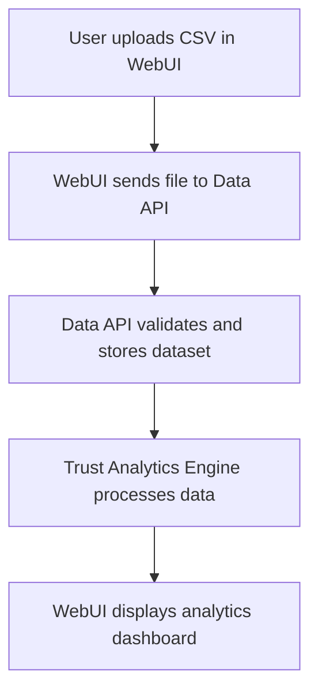

# 📊 Dataset Upload & Trust Analytics – End-to-End Example

## Scenario
A data engineer uploads a new CSV dataset via the WebUI and runs trust analytics to assess data quality and risk.

## Step-by-Step WebUI Walkthrough
1. **Open the Unified WebUI** (`launch_workflow_webui.py`).
2. **Go to the 'Dataset Upload & Analysis' page.**
3. **Click 'Upload Dataset'** and select a CSV file.
4. **View upload status and dataset preview.**
5. **Click 'Run Trust Analytics'.**
6. **View analytics dashboard:**
   - Trust scores per column/row
   - Data quality issues
   - Risk heatmap
   - Downloadable report

## WebUI Screenshot/Mockup
```
+-----------------------------------------------+
| [Upload Dataset]  [Run Trust Analytics]       |
+-----------------------------------------------+
| Dataset: mydata.csv (1000 rows)               |
| Preview: ...                                  |
| [Trust Score Chart] [Risk Heatmap]            |
| [Download Report]                             |
+-----------------------------------------------+
```

## Flow Diagram


## Example API Call
```python
import requests
files = {'file': open('mydata.csv', 'rb')}
response = requests.post("http://localhost:8000/data/upload", files=files)
print(response.json())
```

## Expected Outcome
```json
{
  "status": "success",
  "dataset_id": "abc123",
  "message": "Dataset uploaded and validated."
}
```

## Best Practices
- Validate your CSV before upload.
- Use analytics to identify and remediate data issues.
- Download reports for compliance or sharing. 