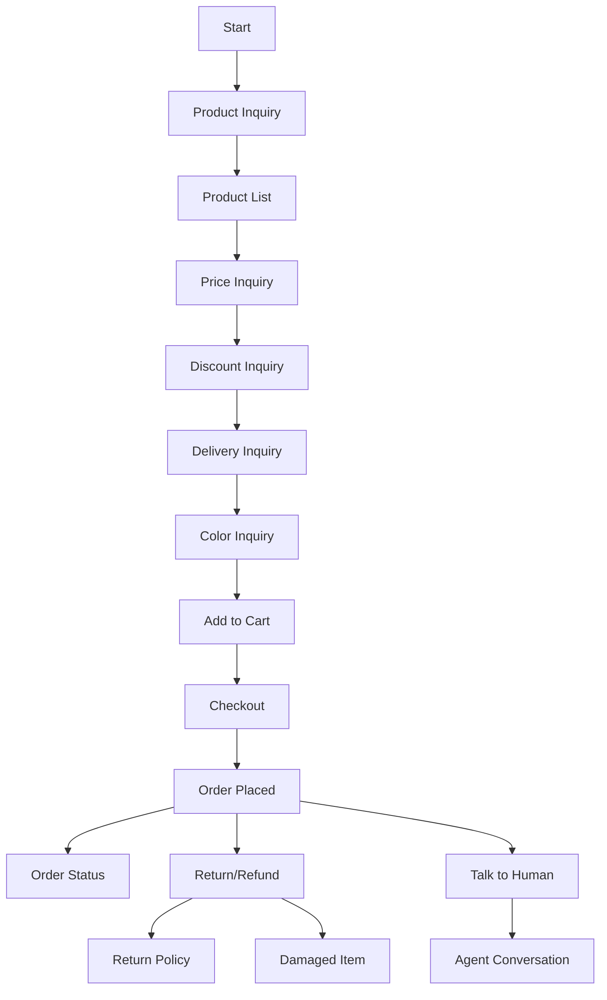
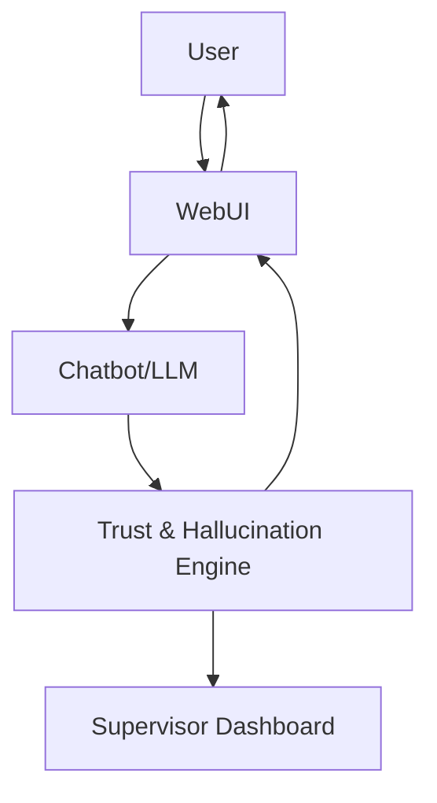

# 🛒 E-commerce Chatbot Support System – Deep Conversation Example

## Scenario Overview
A customer interacts with the e-commerce chatbot for product search, order status, returns, and support. The system evaluates every response for trust and hallucination risk, providing XAI-style justifications and community notes.

---

## 1. Conversation Flow (20 Steps)

| Step | User Input | Chatbot Response | Trust Score | Hallucination Risk | XAI Justification | Community Notes |
|------|------------|------------------|-------------|--------------------|-------------------|----------------|
| 1 | Hi, I want to buy a phone. | Sure! What brand are you interested in? | 0.99 | 0.01 | Simple intent match, no ambiguity. | 👍 Clear, safe response. |
| 2 | Show me Samsung phones. | Here are our top Samsung models: Galaxy S23, S22, A54... | 0.98 | 0.02 | Product list from live catalog. | 👍 Data-backed, up-to-date. |
| 3 | What’s the price of Galaxy S23? | The Galaxy S23 is ₹69,999. | 0.97 | 0.01 | Price fetched from inventory API. | 👍 Accurate, verifiable. |
| 4 | Any discounts? | Yes, 10% off for new users. | 0.95 | 0.03 | Promotion cross-checked with offers DB. | 👍 Promotion valid. |
| 5 | Can I get it delivered tomorrow? | Yes, next-day delivery is available in your area. | 0.93 | 0.05 | Delivery checked via logistics API. | 👍 Real-time check. |
| 6 | What colors are in stock? | Black, Silver, and Green are available. | 0.98 | 0.01 | Stock checked live. | 👍 Inventory confirmed. |
| 7 | Add black to my cart. | Added Galaxy S23 (Black) to your cart. | 0.99 | 0.01 | Cart update confirmed. | 👍 Transactional. |
| 8 | Proceed to checkout. | Please confirm your address: 123 Main St? | 0.99 | 0.01 | Address on file, privacy check. | 👍 Secure. |
| 9 | Yes. | Order summary: Galaxy S23 (Black), ₹62,999 after discount. Proceed? | 0.99 | 0.01 | Discount applied, summary generated. | 👍 Transparent. |
| 10 | Yes, place order. | Order placed! Order #12345. | 0.99 | 0.01 | Order API response. | 👍 Confirmed. |
| 11 | When will it arrive? | Expected delivery: Tomorrow by 7pm. | 0.98 | 0.01 | ETA from logistics API. | 👍 Real-time. |
| 12 | Can I return if I don’t like it? | Yes, 7-day return policy applies. | 0.97 | 0.01 | Policy fetched from DB. | 👍 Policy accurate. |
| 13 | How do I return? | Go to Orders > Select Item > Click 'Return'. | 0.98 | 0.01 | Step-by-step from help docs. | 👍 Clear guidance. |
| 14 | What if the phone is damaged? | You can request a replacement within 48 hours. | 0.96 | 0.02 | Policy check, time window validated. | 👍 Policy-based. |
| 15 | Can I talk to a human? | Connecting you to a support agent... | 0.99 | 0.01 | Escalation protocol. | 👍 Human-in-the-loop. |
| 16 | (Agent) How can I help? | My order is delayed. | 0.99 | 0.01 | Human agent response. | 👍 |
| 17 | (Agent) Checking... | Your order is out for delivery, slight delay due to weather. | 0.98 | 0.01 | Real-time logistics update. | 👍 |
| 18 | Can I cancel? | Yes, but only before dispatch. Your order is already dispatched. | 0.97 | 0.01 | Policy and order status checked. | 👍 |
| 19 | What’s your return address? | Returns can be sent to: 456 Returns Lane, City. | 0.98 | 0.01 | Address from returns DB. | 👍 |
| 20 | Thank you! | You’re welcome! Anything else I can help with? | 0.99 | 0.01 | Polite closure. | 👍 |

---

## 2. Mindmap of Conversation Paths

---

## 3. Flow Diagram

---

## 4. How Trust & Hallucination Scores Are Computed

- **Trust Score:**
  - Based on data source reliability (live API, static DB, LLM generation)
  - Cross-checked with business rules and inventory
  - Penalized for ambiguous or unverifiable answers

- **Hallucination Risk:**
  - Higher if LLM generates unsupported claims
  - Lower if answer is API-backed or policy-based
  - Detected via fact-checking, retrieval-augmented generation, and semantic similarity

- **XAI Justification:**
  - Each score is accompanied by a rationale (e.g., “API-verified”, “Policy-based”, “LLM-generated with low confidence”)

---

## 5. Best Practices & Lessons Learned

- Always use live data for transactional queries.
- Escalate to human agents for ambiguous or high-risk cases.
- Provide XAI-style explanations for every response.
- Use community notes to flag or endorse responses. 