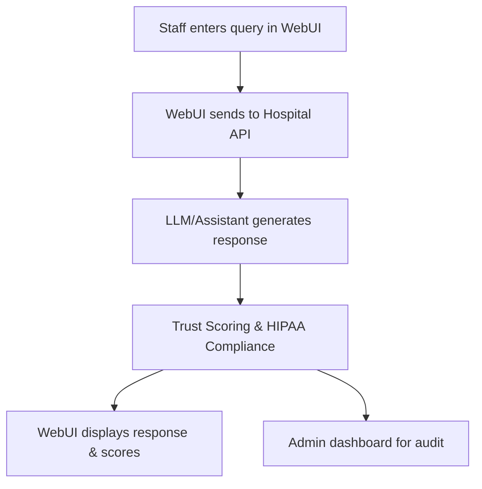

# 🏥 Hospital Daily Operations & Support Chat System – End-to-End Example

## Scenario
Hospital staff use the WebUI to coordinate daily operations, answer patient queries, and support clinical workflows. The system ensures LLM responses are accurate, safe, and compliant with healthcare regulations.

## Step-by-Step WebUI Walkthrough
1. **Open the Unified WebUI** (`launch_workflow_webui.py`).
2. **Go to the 'Hospital Operations Support' page.**
3. **Enter a staff or patient query** (e.g., "What is the next appointment for John Doe?").
4. **Chatbot/assistant responds with schedule or operational info.**
5. **System evaluates trust, hallucination risk, and HIPAA compliance.**
6. **Admin dashboard shows flagged responses and audit logs.**

## WebUI Screenshot/Mockup
```
+---------------------------------------------------+
| Staff: What is the next appointment for John Doe? |
| Assistant: John Doe's next appointment is at 2pm. |
| Trust Score: 0.98 | Hallucination Risk: 0.02      |
| Compliance: HIPAA Passed                          |
+---------------------------------------------------+
```

## Flow Diagram


## Example API Call
```python
import requests
payload = {"query": "What is the next appointment for John Doe?", "patient_id": "JD123"}
response = requests.post("http://localhost:8000/hospital/support", json=payload)
print(response.json())
```

## Expected Outcome
```json
{
  "response": "John Doe's next appointment is at 2pm.",
  "trust_score": 0.98,
  "hallucination_risk": 0.02,
  "compliance": true
}
```

## Best Practices
- Always check for HIPAA compliance before displaying patient data.
- Use trust and hallucination scores to flag risky responses.
- Maintain audit logs for all operational queries. 