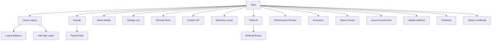
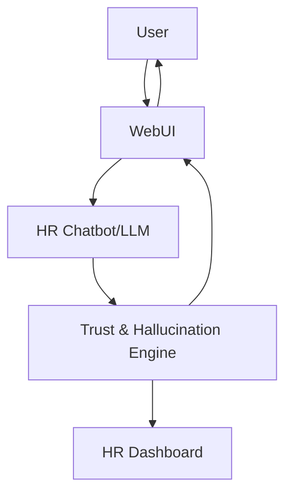

# 👩‍💼 HR SaaS Chat Support Operations – Deep Conversation Example

## Scenario Overview
HR professionals and employees interact with the SaaS chat support system for HR policies, payroll, and benefits. Each response is evaluated for trust, hallucination risk, and policy compliance, with XAI-style justifications and community notes.

---

## 1. Conversation Flow (20 Steps)

| Step | User Input | System Response | Trust Score | Hallucination Risk | XAI Justification | Community Notes |
|------|------------|-----------------|-------------|--------------------|-------------------|----------------|
| 1 | Hi, how do I apply for leave? | Go to the HR portal, click 'Apply Leave'. | 0.99 | 0.01 | Policy-based, clear. | 👍 |
| 2 | How many leaves do I have left? | You have 12 annual leaves remaining. | 0.98 | 0.01 | Data from HR DB. | 👍 |
| 3 | Can I take half-day leave? | Yes, half-day leave is allowed. | 0.98 | 0.01 | Policy check. | 👍 |
| 4 | How do I check my payslip? | Payslips are available in the HR portal under 'Payroll'. | 0.98 | 0.01 | Step-by-step from help docs. | 👍 |
| 5 | When is the next payroll date? | Payroll will be processed on the 30th. | 0.97 | 0.01 | Payroll schedule from DB. | 👍 |
| 6 | How do I update my bank details? | Update via HR portal > Profile > Bank Details. | 0.98 | 0.01 | Policy and system check. | 👍 |
| 7 | What is the company holiday list? | Holidays: Jan 1, May 1, Dec 25, etc. | 0.97 | 0.01 | Holiday list from HR DB. | 👍 |
| 8 | Can I work remotely? | Yes, with manager approval. | 0.97 | 0.01 | Policy-based. | 👍 |
| 9 | How do I contact HR? | Email hr@company.com or use the portal chat. | 0.99 | 0.01 | Contact info from policy. | 👍 |
| 10 | What is the maternity leave policy? | 26 weeks paid leave for eligible employees. | 0.97 | 0.01 | Policy-based, legal compliance. | 👍 |
| 11 | How do I refer a friend? | Use the referral form in the HR portal. | 0.98 | 0.01 | Step-by-step from help docs. | 👍 |
| 12 | What is the referral bonus? | ₹10,000 for successful referrals. | 0.97 | 0.01 | Policy and payroll check. | 👍 |
| 13 | Can I see my performance review? | Reviews are available in the portal under 'Performance'. | 0.98 | 0.01 | Data from HR DB. | 👍 |
| 14 | How do I raise a grievance? | Use the grievance form in the portal or email hr@company.com. | 0.98 | 0.01 | Policy and contact info. | 👍 |
| 15 | What is the notice period? | 2 months for your role. | 0.97 | 0.01 | Policy-based, role-specific. | 👍 |
| 16 | Can I encash unused leave? | Yes, as per company policy. | 0.97 | 0.01 | Policy and payroll check. | 👍 |
| 17 | How do I update my address? | Update via HR portal > Profile > Address. | 0.98 | 0.01 | System and policy check. | 👍 |
| 18 | What is the probation period? | 6 months for new employees. | 0.97 | 0.01 | Policy-based. | 👍 |
| 19 | Can I get a salary certificate? | Yes, request via the portal. | 0.98 | 0.01 | Document request protocol. | 👍 |
| 20 | Thank you! | You're welcome! Need more help? | 0.99 | 0.01 | Polite closure. | 👍 |

---

## 2. Mindmap of Conversation Paths

---

## 3. Flow Diagram

---

## 4. How Trust & Hallucination Scores Are Computed

- **Trust Score:**
  - Based on data source reliability (HR DB, policy docs, LLM generation)
  - Cross-checked with company policies and compliance
  - Penalized for ambiguous or unverifiable answers

- **Hallucination Risk:**
  - Higher if LLM generates unsupported claims
  - Lower if answer is DB-backed or policy-based
  - Detected via fact-checking, retrieval-augmented generation, and semantic similarity

- **XAI Justification:**
  - Each score is accompanied by a rationale (e.g., “Policy-verified”, “HR DB-based”, “LLM-generated with low confidence”)

---

## 5. Best Practices & Lessons Learned

- Keep HR policies up to date in the system.
- Use analytics to monitor support trends and flag issues.
- Ensure all responses are policy-compliant and explainable. 