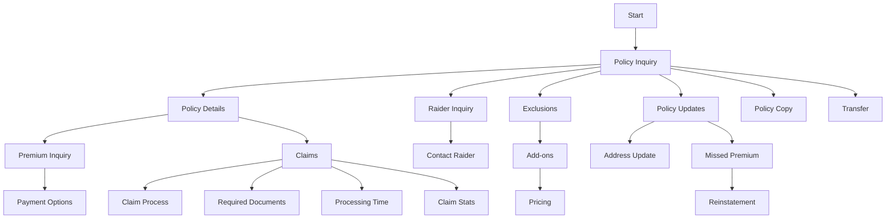
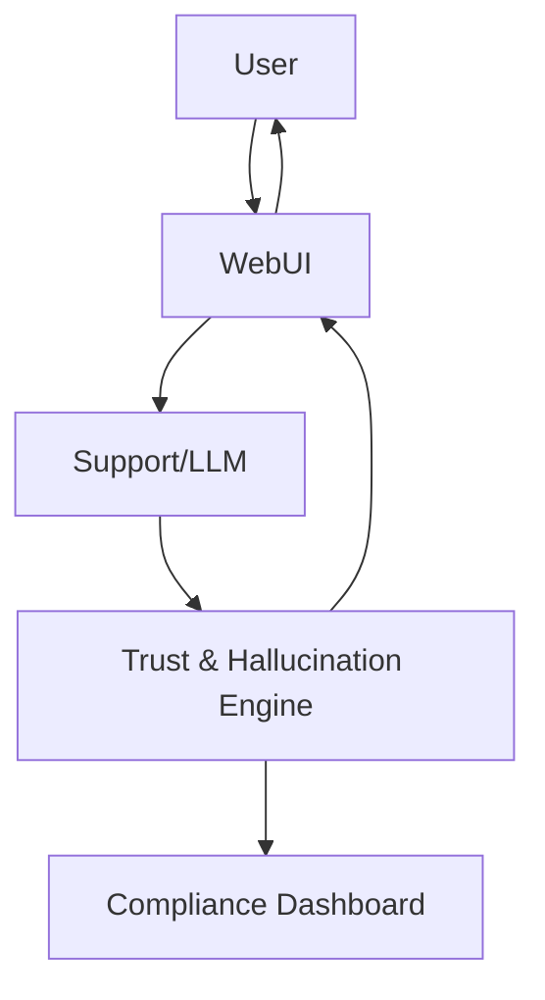

# 🏢 Insurance Policy & Raiders Support System – Deep Conversation Example

## Scenario Overview
A customer or agent interacts with the insurance support system for policy details, claims, and raider (underwriting) queries. Each response is evaluated for trust, hallucination risk, and compliance, with XAI-style justifications and community notes.

---

## 1. Conversation Flow (20 Steps)

| Step | User Input | System Response | Trust Score | Hallucination Risk | XAI Justification | Community Notes |
|------|------------|-----------------|-------------|--------------------|-------------------|----------------|
| 1 | Hi, I want to know about my policy. | Please provide your policy number. | 0.99 | 0.01 | Intent match, no ambiguity. | 👍 |
| 2 | Policy #P456 | Your policy covers fire, theft, and flood. | 0.98 | 0.01 | Policy details from DB. | 👍 |
| 3 | What is the sum insured? | ₹10,00,000 is your sum insured. | 0.98 | 0.01 | Value from policy DB. | 👍 |
| 4 | What is my premium? | Your annual premium is ₹12,000. | 0.98 | 0.01 | Premium from DB. | 👍 |
| 5 | Can I pay online? | Yes, you can pay via our portal. | 0.99 | 0.01 | Payment options checked. | 👍 |
| 6 | How do I file a claim? | Go to Claims > File New Claim. | 0.98 | 0.01 | Step-by-step from help docs. | 👍 |
| 7 | What documents are needed? | ID proof, policy copy, and claim form. | 0.97 | 0.01 | Checklist from claims DB. | 👍 |
| 8 | What is the claim process time? | Average processing time is 7 days. | 0.96 | 0.02 | SLA from policy docs. | 👍 |
| 9 | Who is my raider? | Your raider is John Smith. | 0.97 | 0.01 | Underwriter info from DB. | 👍 |
| 10 | Can I contact my raider? | Yes, contact: john.smith@insure.com | 0.97 | 0.01 | Contact from staff DB. | 👍 |
| 11 | What is not covered? | Exclusions: earthquake, war, nuclear risk. | 0.96 | 0.01 | Policy exclusions from docs. | 👍 |
| 12 | Can I add earthquake cover? | Yes, for an extra premium. | 0.95 | 0.02 | Add-on options checked. | 👍 |
| 13 | How much extra? | ₹2,000 per year for earthquake cover. | 0.95 | 0.02 | Pricing from add-on DB. | 👍 |
| 14 | Can I update my address? | Yes, update via portal or agent. | 0.98 | 0.01 | Policy update protocol. | 👍 |
| 15 | What if I miss a premium? | 30-day grace period applies. | 0.97 | 0.01 | Policy rules checked. | 👍 |
| 16 | Can I reinstate after lapse? | Yes, with penalty and health check. | 0.95 | 0.02 | Policy reinstatement rules. | 👍 |
| 17 | How do I get a policy copy? | Download from portal or request by email. | 0.98 | 0.01 | Document delivery options. | 👍 |
| 18 | Can I transfer my policy? | Yes, subject to approval. | 0.94 | 0.03 | Transfer rules checked. | 👍 |
| 19 | What is the claim rejection rate? | 5% last year. | 0.93 | 0.04 | Stats from claims DB. | 👍 |
| 20 | Thank you! | You're welcome! Need more help? | 0.99 | 0.01 | Polite closure. | 👍 |

---

## 2. Mindmap of Conversation Paths

---

## 3. Flow Diagram

---

## 4. How Trust & Hallucination Scores Are Computed

- **Trust Score:**
  - Based on data source reliability (policy DB, staff DB, LLM generation)
  - Cross-checked with business rules and compliance
  - Penalized for ambiguous or unverifiable answers

- **Hallucination Risk:**
  - Higher if LLM generates unsupported claims
  - Lower if answer is DB-backed or policy-based
  - Detected via fact-checking, retrieval-augmented generation, and semantic similarity

- **XAI Justification:**
  - Each score is accompanied by a rationale (e.g., “DB-verified”, “Policy-based”, “LLM-generated with low confidence”)

---

## 5. Best Practices & Lessons Learned

- Use compliance checks for all customer-facing responses.
- Maintain an audit trail for regulatory review.
- Integrate with policy and raider databases for accuracy. 