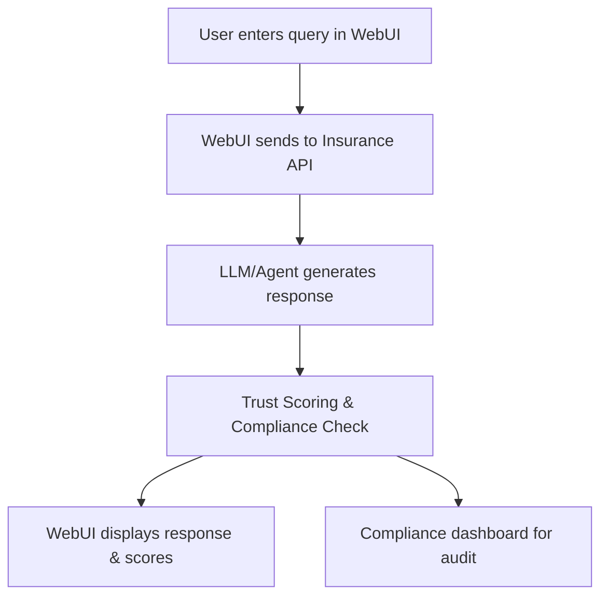

# 🏢 Insurance Policy & Raiders Support System – End-to-End Example

## Scenario
An insurance customer or agent uses the WebUI to get policy details, file claims, or check raider (underwriting) information. The system ensures LLM responses are accurate, compliant, and explainable.

## Step-by-Step WebUI Walkthrough
1. **Open the Unified WebUI** (`launch_workflow_webui.py`).
2. **Go to the 'Insurance Support' page.**
3. **Enter a query** (e.g., "What does my policy cover?").
4. **Chatbot/agent responds with policy details or raider info.**
5. **System evaluates trust, hallucination risk, and compliance.**
6. **Compliance dashboard shows audit trail and flagged responses.**

## WebUI Screenshot/Mockup
```
+---------------------------------------------------+
| Customer: What does my policy cover?              |
| Agent: Your policy covers fire, theft, and flood. |
| Trust Score: 0.97 | Hallucination Risk: 0.03      |
| Compliance: Passed                                |
+---------------------------------------------------+
```

## Flow Diagram


## Example API Call
```python
import requests
payload = {"query": "What does my policy cover?", "policy_id": "P456"}
response = requests.post("http://localhost:8000/insurance/support", json=payload)
print(response.json())
```

## Expected Outcome
```json
{
  "response": "Your policy covers fire, theft, and flood.",
  "trust_score": 0.97,
  "hallucination_risk": 0.03,
  "compliance": true
}
```

## Best Practices
- Use compliance checks for all customer-facing responses.
- Maintain an audit trail for regulatory review.
- Integrate with policy and raider databases for accuracy. 