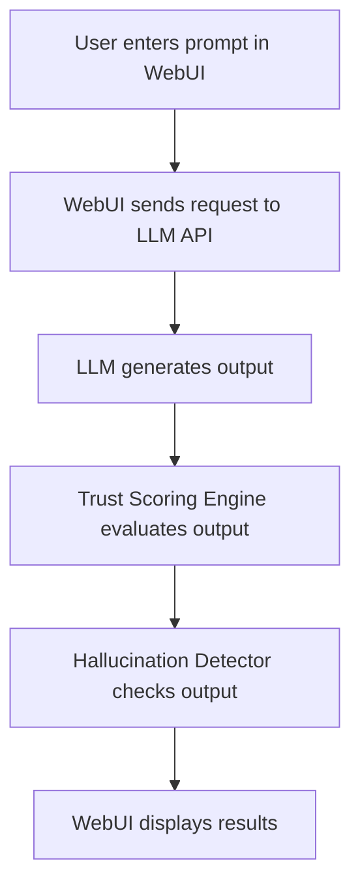

# 🤖 LLM Trust Scoring – End-to-End Example

## Scenario
A user wants to evaluate the trustworthiness of an LLM-generated answer using the OpenTrustEval WebUI. The system will score the output, detect hallucinations, and provide an explanation.

## Step-by-Step WebUI Walkthrough
1. **Open the Unified WebUI** (`launch_workflow_webui.py`).
2. **Navigate to the 'LLM Trust Scoring' page.**
3. **Enter a prompt** (e.g., "What is the capital of France?") and select an LLM model.
4. **Click 'Evaluate'.**
5. **View results:**
   - LLM output
   - Trust score
   - Hallucination risk
   - Explanation

## WebUI Screenshot/Mockup
```
+---------------------------------------------------+
| Prompt: [What is the capital of France?]          |
| Model: [llama-3-8b ▼]   [Evaluate]                |
+---------------------------------------------------+
| Output: The capital of France is Paris.           |
| Trust Score: 0.98                                 |
| Hallucination Risk: 0.02                          |
| Explanation: Fact verified. No hallucination.     |
+---------------------------------------------------+
```

## Flow Diagram


## Example API Call
```python
import requests
payload = {"prompt": "What is the capital of France?", "model": "llama-3-8b"}
response = requests.post("http://localhost:8000/llm/score", json=payload)
print(response.json())
```

## Expected Outcome
```json
{
  "output": "The capital of France is Paris.",
  "trust_score": 0.98,
  "risk_percentage": 0.02,
  "explanation": "Fact verified. No hallucination detected."
}
```

## Best Practices
- Use clear, factual prompts for best results.
- Review explanations for transparency.
- Use the API for automation or batch evaluation. 