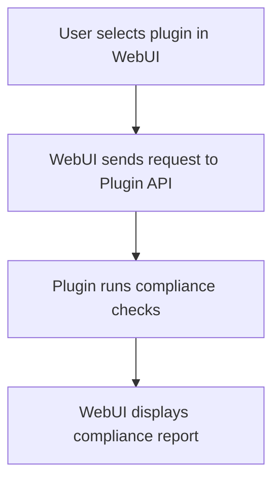

# 🛡️ Plugin Compliance Check – End-to-End Example

## Scenario
A compliance officer uses the WebUI to run a GDPR compliance plugin on a new dataset, ensuring all data meets regulatory standards.

## Step-by-Step WebUI Walkthrough
1. **Open the Unified WebUI** (`launch_workflow_webui.py`).
2. **Navigate to the 'Plugins & Compliance' page.**
3. **Select the 'EU GDPR Compliance' plugin.**
4. **Upload or select a dataset.**
5. **Click 'Run Plugin'.**
6. **View compliance report:**
   - Issues found
   - Remediation suggestions
   - Downloadable compliance certificate

## WebUI Screenshot/Mockup
```
+-----------------------------------------------+
| [Select Plugin: EU GDPR Compliance ▼]         |
| [Upload Dataset]  [Run Plugin]                |
+-----------------------------------------------+
| Compliance Report:                            |
| - No PII found in columns: name, email        |
| - All records compliant                       |
| [Download Certificate]                        |
+-----------------------------------------------+
```

## Flow Diagram


## Example API Call
```python
import requests
payload = {"plugin": "eu_gdpr_embed", "dataset_id": "abc123"}
response = requests.post("http://localhost:8000/plugins/run", json=payload)
print(response.json())
```

## Expected Outcome
```json
{
  "status": "success",
  "compliance": true,
  "issues": [],
  "certificate_url": "/downloads/cert_abc123.pdf"
}
```

## Best Practices
- Regularly run compliance plugins on new data.
- Review reports and address any issues found.
- Store certificates for audit purposes. 