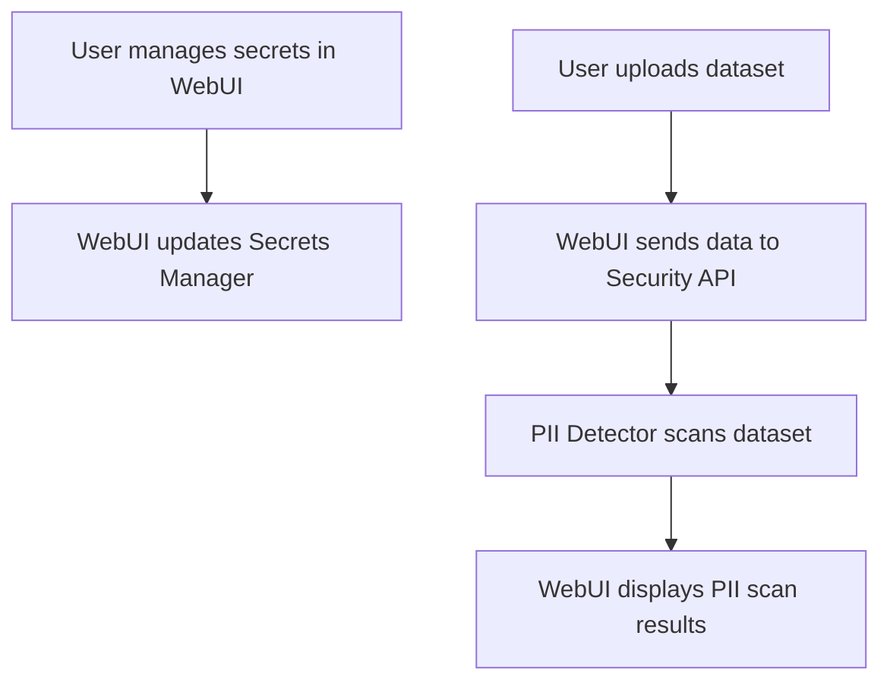

# 🔒 Security Workflow – Secrets Management & PII Detection Example

## Scenario
A security engineer uses the WebUI to manage secrets and run PII detection on uploaded datasets, ensuring compliance and data safety.

## Step-by-Step WebUI Walkthrough
1. **Open the Unified WebUI** (`launch_workflow_webui.py`).
2. **Navigate to the 'Security & Compliance' page.**
3. **Add or update secrets (API keys, credentials).**
4. **Upload a dataset for PII detection.**
5. **Click 'Run PII Scan'.**
6. **View scan results:**
   - Detected PII fields
   - Risk assessment
   - Remediation actions

## WebUI Screenshot/Mockup
```
+-----------------------------------------------+
| [Add Secret] [Upload Dataset] [Run PII Scan]  |
+-----------------------------------------------+
| Secrets: api_key_1, db_password               |
| PII Scan Results:                             |
| - Column: email – Risk: High                  |
| - Column: phone – Risk: Medium                |
| [Remediate]                                   |
+-----------------------------------------------+
```

## Flow Diagram


## Example API Call
```python
import requests
payload = {"dataset_id": "abc123"}
response = requests.post("http://localhost:8000/security/pii_scan", json=payload)
print(response.json())
```

## Expected Outcome
```json
{
  "status": "success",
  "pii_fields": [
    {"column": "email", "risk": "high"},
    {"column": "phone", "risk": "medium"}
  ],
  "remediation": ["Mask email", "Hash phone"]
}
```

## Best Practices
- Regularly scan datasets for PII before analysis or sharing.
- Use the secrets manager to rotate credentials securely.
- Remediate high-risk fields before production use. 