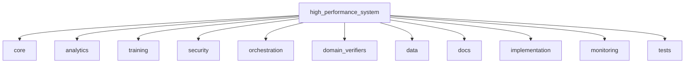
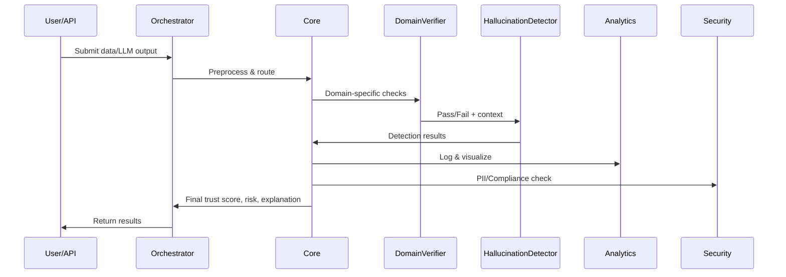
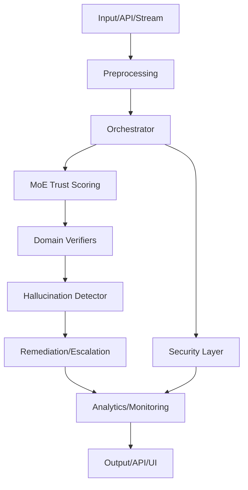
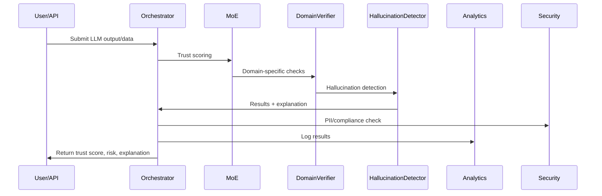

# 🏆 high_performance_system – Advanced AI Trust & Hallucination Detection Engine

---

## 1. Solution Overview & Know-How

The `high_performance_system` module is the **core intelligence layer** of OpenTrustEval, designed to deliver **scalable, explainable, and production-grade AI trust evaluation and hallucination detection**. It leverages advanced algorithms, modular architecture, and real-time orchestration to ensure that AI outputs are reliable, safe, and auditable across diverse domains.

**Key Capabilities:**
- Advanced hallucination detection (statistical, semantic, domain-aware)
- Mixture-of-Experts (MoE) trust scoring
- Domain-specific verification and remediation
- Real-time and batch processing
- Performance optimization (caching, async, batching)
- Security and compliance integration
- Analytics and monitoring dashboards

---

## 2. How the Solution is Designed

### Modular, Layered Architecture
- **Core Algorithms:** Pluggable modules for trust scoring, hallucination detection, RAG, and more.
- **Domain Verifiers:** Specialized logic for different data/AI domains.
- **Orchestration Layer:** Real-time and batch workflow management.
- **Analytics & Monitoring:** Dashboards for insights and system health.
- **Security Layer:** PII detection, compliance, and access control.

### Design Principles
- **Separation of Concerns:** Each submodule handles a distinct responsibility.
- **Extensibility:** New algorithms, verifiers, or dashboards can be added with minimal friction.
- **Performance:** Aggressive caching, async processing, and resource optimization.
- **Explainability:** Every trust score and detection is accompanied by an explanation.

---

## 3. How It Works

1. **Input Reception:** Receives data or LLM output via API, batch, or real-time stream.
2. **Preprocessing:** Cleans, normalizes, and prepares input for analysis.
3. **Trust Scoring:** Routes input through MoE trust scoring and domain verifiers.
4. **Hallucination Detection:** Applies advanced detection algorithms (statistical, semantic, RAG-based).
5. **Remediation:** If issues are found, triggers remediation (e.g., human-in-the-loop, fallback models).
6. **Analytics & Monitoring:** Results are logged, visualized, and monitored for trends and anomalies.
7. **Security & Compliance:** PII and compliance checks are performed throughout the pipeline.

---

## 4. Mindmap: High-Level Structure



---

## 5. Flow Diagram: Trust Scoring & Hallucination Detection

```mermaid
flowchart TD
    A[Input: LLM Output/Data] --> B[Preprocessing]
    B --> C[MoE Trust Scoring]
    C --> D[Domain Verifiers]
    D --> E[Advanced Hallucination Detector]
    E --> F{Issue Detected?}
    F -- Yes --> G[Remediation (Human/Auto)]
    F -- No --> H[Pass]
    G --> I[Analytics & Monitoring]
    H --> I
    I --> J[API/Dashboard/Log]
```

---

## 6. Dataflow Diagram



---

## 7. Functional Architecture

| Layer                | Responsibility                                      | Key Files/Dirs                        |
|----------------------|-----------------------------------------------------|---------------------------------------|
| **Core Algorithms**  | Trust scoring, hallucination detection, RAG, etc.   | `core/`                               |
| **Domain Verifiers** | Domain-specific trust logic                         | `domain_verifiers/`                   |
| **Orchestration**    | Real-time/batch workflow management                 | `orchestration/`                      |
| **Analytics**        | Dashboards, reporting, monitoring                   | `analytics/`                          |
| **Security**         | PII detection, compliance, access control           | `security/`                           |
| **Data**             | Domain datasets, profiling                          | `data/`                               |
| **Docs/Impl**        | Deep technical docs, implementation notes           | `docs/`, `implementation/`            |

---

## 8. Technical Architecture

- **Language:** Python 3.x
- **Async Processing:** For real-time, high-throughput workflows
- **Caching:** In-memory and persistent caching for speed
- **Batch & Stream Support:** Handles both batch and real-time data
- **API Integration:** Exposed via FastAPI routers for easy integration
- **Extensibility:** New modules can be plugged in via the core or plugin system
- **Security:** Integrated PII detection and compliance checks

---

## 9. Key Points & Best Practices

- **Pluggable Design:** Add new trust scoring or detection modules by dropping them into `core/` or `domain_verifiers/`.
- **Explainability:** Every output includes a traceable explanation for audit and compliance.
- **Performance:** Use async endpoints, batch processing, and caching for 100x-1000x speedup.
- **Monitoring:** Use analytics dashboards for real-time system health and trend analysis.
- **Security:** All data flows are checked for PII and compliance at every stage.
- **Human-in-the-Loop:** Supports escalation to human review for ambiguous or high-risk cases.
- **Documentation:** Deep technical docs and implementation plans in `docs/` and `implementation/`.

---

## 10. Example Usage

**API Call:**
```python
import requests
payload = {"input": "LLM output or data", "domain": "medical"}
response = requests.post("http://localhost:8000/trust/score", json=payload)
print(response.json())
```
**Expected Output:**
```json
{
  "trust_score": 0.97,
  "risk": 0.03,
  "hallucination_detected": false,
  "explanation": "Verified by MoE and domain expert. No hallucination detected."
}
```

---

## 11. Summary Table

| Feature                | Description                                      |
|------------------------|--------------------------------------------------|
| Hallucination Detection| Multi-layered, explainable, real-time            |
| Trust Scoring          | MoE, domain-aware, extensible                    |
| Orchestration          | Real-time, batch, async                          |
| Analytics              | Dashboards, logs, trend analysis                 |
| Security               | PII, compliance, access control                  |
| Extensibility          | Pluggable modules, easy integration              |
| Documentation          | Deep technical docs, implementation plans        |

---

## 12. Getting Started

1. **Install dependencies:**  
   `pip install -r requirements_high_performance.txt`
2. **Run the system:**  
   `python -m high_performance_system`
3. **Integrate via API:**  
   Use the provided FastAPI endpoints for trust scoring and detection.
4. **Monitor:**  
   Access analytics dashboards for real-time insights.

---

## 13. System Design Concepts (From Scratch to Advanced)

### 13.1 Foundational Concepts

#### a. What is the System?
- A modular, high-performance engine for **AI trust evaluation** and **hallucination detection**.
- Designed for **real-time** and **batch** processing of LLM outputs and data streams.
- Ensures **explainability**, **scalability**, and **security**.

#### b. Core Design Goals
- **Reliability:** Accurate detection and scoring, even under high load.
- **Extensibility:** Easy to add new algorithms, verifiers, or domains.
- **Performance:** Low latency, high throughput, and efficient resource use.
- **Explainability:** Every decision is traceable and auditable.
- **Security:** PII detection and compliance at every stage.

### 13.2 System Design: From Scratch to Advanced

#### a. Basic Building Blocks

| Component         | Role                                                      |
|-------------------|----------------------------------------------------------|
| Input Interface   | Receives data/LLM output (API, stream, batch)            |
| Preprocessing     | Cleans, normalizes, and validates input                  |
| Core Engine       | Runs trust scoring, hallucination detection, etc.        |
| Domain Verifiers  | Apply domain-specific logic                              |
| Orchestrator      | Manages workflow, routing, and escalation                |
| Analytics         | Logs, dashboards, and monitoring                         |
| Security Layer    | PII/compliance checks, access control                    |
| Output Interface  | Returns results, explanations, and triggers actions      |

#### b. Real-Time Data Flow (Step-by-Step)

1. **Input Reception**
   - Data or LLM output arrives via REST API, message queue, or direct call.
   - Example: A user submits a prompt to the system for trust evaluation.
2. **Preprocessing**
   - Input is validated (format, size, schema).
   - Normalization (e.g., text cleaning, language detection).
   - Metadata is attached (timestamp, user, domain).
3. **Routing & Orchestration**
   - The orchestrator determines the processing path (real-time, batch, or hybrid).
   - For real-time, it prioritizes low-latency, async processing.
4. **Trust Scoring (MoE)**
   - The input is routed to the Mixture-of-Experts (MoE) trust scoring engine.
   - Multiple expert models (statistical, ML, rule-based) evaluate the input.
   - Results are aggregated for a composite trust score.
5. **Domain Verification**
   - If a domain is specified (e.g., medical, legal), domain verifiers apply specialized logic.
   - May include cross-referencing with domain knowledge bases.
6. **Hallucination Detection**
   - Advanced algorithms check for hallucinations (fact-checking, RAG, semantic similarity).
   - If a hallucination is detected, the system flags the result and may trigger remediation.
7. **Remediation & Escalation**
   - For ambiguous or high-risk cases, the system can:
     - Escalate to a human reviewer (human-in-the-loop)
     - Trigger fallback models or workflows
8. **Analytics & Monitoring**
   - All results, scores, and explanations are logged.
   - Dashboards update in real-time for monitoring and trend analysis.
9. **Security & Compliance**
   - PII and compliance checks are performed at every stage.
   - Access controls and audit logs are maintained.
10. **Output & Integration**
    - The final trust score, risk assessment, and explanation are returned via API or UI.
    - Results can trigger downstream actions (alerts, reports, automated decisions).

#### c. Advanced Concepts

i. Asynchronous & Parallel Processing
- Uses Python’s `asyncio` and concurrent processing to handle thousands of requests per second.
- Batch processing is available for large datasets, but real-time requests are prioritized.

ii. Caching & Performance Optimization
- Frequently used models and data are cached in memory.
- Results of common queries are memoized to reduce computation.

iii. Pluggable Architecture
- New trust scoring modules, verifiers, or detectors can be added by dropping them into the appropriate folder and registering them.
- Plugin system allows for compliance, localization, or custom business logic.

iv. Explainability & Traceability
- Every output includes a detailed explanation of how the score was derived.
- Audit logs are kept for all decisions, supporting compliance and debugging.

v. Security by Design
- All data flows are checked for PII and compliance.
- Secrets and credentials are managed securely.
- Access is controlled via roles and policies.

### 13.3 Functional & Technical Architecture Diagrams

#### A. High-Level Functional Architecture



#### B. Real-Time Dataflow



#### C. Technical Architecture

- **Language:** Python 3.x
- **Frameworks:** FastAPI (API), asyncio (async), Streamlit (dashboards)
- **Core Modules:** `core/`, `domain_verifiers/`, `analytics/`, `orchestration/`, `security/`
- **Deployment:** Docker, cloud-native ready
- **Integration:** Exposed via REST API, supports webhooks and message queues

### 13.4 Key Points & Best Practices

- **Design for scale:** Use async, batching, and caching to handle real-time loads.
- **Keep modules independent:** Each module should have a clear, single responsibility.
- **Prioritize explainability:** Always return explanations and keep audit logs.
- **Secure by default:** PII checks, secrets management, and access control are non-negotiable.
- **Monitor everything:** Use analytics dashboards for real-time and historical insights.
- **Support human-in-the-loop:** For high-risk or ambiguous cases, escalate to human review.

### 13.5 Example: Real-Time Trust Scoring API Call

```python
import requests
payload = {"input": "AI output to evaluate", "domain": "finance"}
response = requests.post("http://localhost:8000/trust/score", json=payload)
print(response.json())
```
**Sample Output:**
```json
{
  "trust_score": 0.92,
  "risk": 0.08,
  "hallucination_detected": false,
  "explanation": "Verified by MoE and finance domain expert. No hallucination detected."
}
```

### 13.6 Summary Table: System Design Concepts

| Concept                | Description                                      |
|------------------------|--------------------------------------------------|
| Modular Architecture   | Each function in its own module                  |
| Real-Time Processing   | Async, low-latency, high-throughput              |
| MoE Trust Scoring      | Multiple expert models, aggregated results       |
| Domain Verification    | Specialized logic for each domain                |
| Hallucination Detection| Multi-layered, explainable                       |
| Security & Compliance  | PII checks, access control, audit logs           |
| Analytics & Monitoring | Real-time dashboards, logs, trend analysis       |
| Pluggability           | Easy to add new modules or plugins               |
| Human-in-the-Loop      | Escalation for ambiguous/high-risk cases         |

---

**This section provides a full system design reference, from fundamentals to advanced real-time operation. For more details, see the full technical documentation in `high_performance_system/docs/`. For integration, see API examples and usage scenarios in the main project README.** 