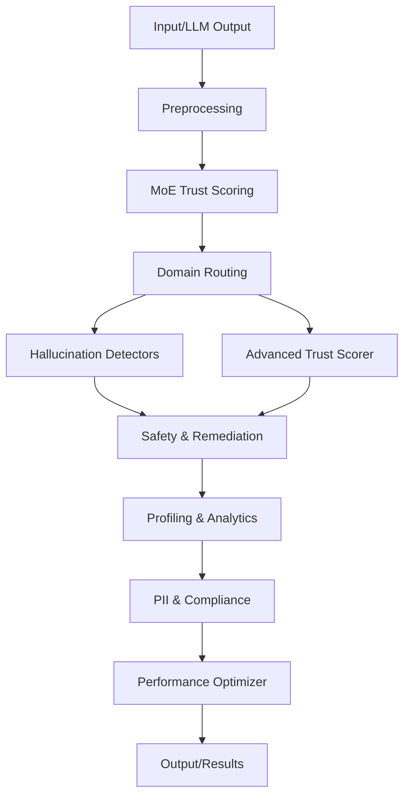
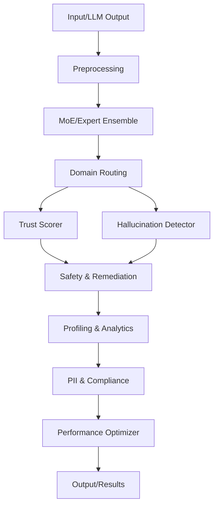

# 🧠 high_performance_system/core – Functional, Technical & System Design

---

## 1. Overview
This folder contains the **core intelligence modules** for OpenTrustEval’s high-performance trust and hallucination detection engine. Each file implements a specialized component in the modular, explainable, and scalable AI evaluation pipeline.

---

## 2. Functional Architecture

- **Trust Scoring:** Advanced, explainable, and domain-aware trust evaluation (e.g., `advanced_trust_scorer.py`, `moe_domain_verifier.py`).
- **Hallucination Detection:** Multi-layered, high-accuracy hallucination detection (e.g., `advanced_hallucination_detector.py`, `high_performance_hallucination_detector.py`).
- **Mixture-of-Experts (MoE):** Ensemble and expert routing for robust scoring (e.g., `ultimate_moe_system.py`, `advanced_expert_ensemble.py`).
- **Domain Routing:** Intelligent routing and verification for domain-specific logic (e.g., `intelligent_domain_router.py`).
- **Safety & Remediation:** Independent safety checks, human-in-the-loop, and fallback logic (e.g., `independent_safety_layer.py`, `human_in_the_loop_remediation.py`).
- **Performance Optimization:** Caching, batching, and async processing (e.g., `performance_optimizer.py`).
- **RAG & Multi-Agent:** Retrieval-augmented generation and agent-based evaluation (e.g., `enhanced_rag_pipeline.py`, `advanced_multi_agent_system.py`).
- **PII & Compliance:** Comprehensive PII detection and universal AI protection (e.g., `comprehensive_pii_detector.py`, `universal_ai_protection.py`).
- **Profiling:** Dataset and feature profiling for explainability (e.g., `enhanced_dataset_profiler.py`, `dataset_profiler.py`).

---

## 3. Technical Architecture

- **Language:** Python 3.x
- **Design:** Modular, pluggable, and extensible
- **Integration:** All modules are callable from the main pipeline and orchestrator
- **Performance:** Async, batch, and cache-enabled for high throughput
- **Explainability:** Each module provides traceable outputs and justifications
- **Security:** PII detection and compliance checks are integrated

---

## 4. System Design & Logical Flow

1. **Input Reception:** Data or LLM output is received by the orchestrator.
2. **Preprocessing:** Input is normalized and routed to the core pipeline.
3. **Trust Scoring:** MoE and advanced trust scorers evaluate the input.
4. **Domain Routing:** Intelligent router directs input to domain-specific verifiers.
5. **Hallucination Detection:** Multi-layered detectors analyze for hallucinations.
6. **Safety & Remediation:** Independent safety checks and human-in-the-loop logic are applied if needed.
7. **Profiling & Analytics:** Dataset and feature profilers generate explainable reports.
8. **PII & Compliance:** PII detectors and universal protection modules ensure compliance.
9. **Performance Optimization:** Caching, batching, and async logic optimize throughput.
10. **Output:** Results, trust scores, risk, and justifications are returned to the orchestrator or API.

---

## 5. Mindmap: Core Module Relationships

---

## 6. File-by-File Breakdown

| File | Role & Description |
|------|-------------------|
| `advanced_trust_scorer.py` | Advanced, explainable trust scoring logic. |
| `moe_domain_verifier.py` | Mixture-of-Experts for domain-specific trust evaluation. |
| `ultimate_moe_system.py` | Orchestrates MoE ensemble for robust scoring. |
| `advanced_expert_ensemble.py` | Advanced ensemble of expert models for trust and risk. |
| `intelligent_domain_router.py` | Routes input to appropriate domain verifiers. |
| `independent_safety_layer.py` | Independent safety checks and fallback logic. |
| `universal_ai_protection.py` | Universal protection against unsafe or non-compliant outputs. |
| `enterprise_deployment_options.py` | Configurations and logic for enterprise deployment. |
| `human_in_the_loop_remediation.py` | Escalation and remediation via human review. |
| `uncertainty_aware_system.py` | Handles uncertainty and ambiguous cases. |
| `performance_optimizer.py` | Caching, batching, and async performance logic. |
| `enhanced_rag_pipeline.py` | Retrieval-augmented generation for factuality. |
| `advanced_multi_agent_system.py` | Multi-agent evaluation and consensus. |
| `comprehensive_pii_detector.py` | Deep PII detection for compliance. |
| `enhanced_dataset_profiler.py` | Advanced profiling for datasets and features. |
| `cleanlab_replacement_system.py` | Cleanlab-compatible label quality and replacement. |
| `dataset_profiler.py` | Dataset profiling and explainability. |
| `high_performance_hallucination_detector.py` | High-accuracy hallucination detection. |
| `advanced_hallucination_detector.py` | Multi-layered hallucination detection. |
| `cleanlab_integration_layer.py` | Integration with Cleanlab for label quality. |

---

## 7. Architecture Diagram

---

## 8. Key Points
- **Modular:** Each file is a plug-and-play component.
- **Explainable:** Outputs include justifications and OTE Notes.
- **Scalable:** Designed for real-time, batch, and async operation.
- **Secure:** PII and compliance are first-class concerns.
- **Extensible:** New modules can be added with minimal changes.

---

For more details, see the code and docstrings in each file, and refer to the main system README for integration and usage examples. 