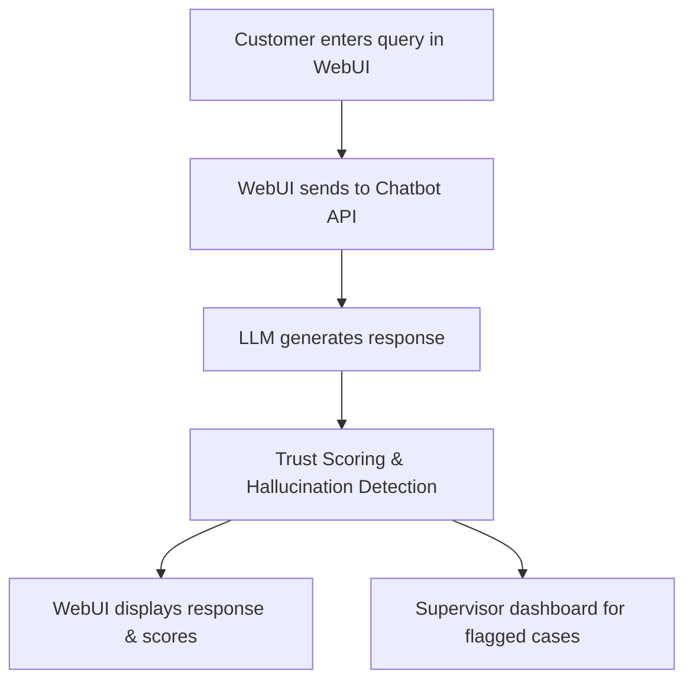

# 🛒 E-commerce Chatbot Support System – End-to-End Example

## Scenario
A customer interacts with an e-commerce chatbot via the WebUI to get product recommendations, order status, and support. The system evaluates LLM responses for trust, detects hallucinations, and ensures compliance with company policies.

## Step-by-Step WebUI Walkthrough
1. **Open the Unified WebUI** (`launch_workflow_webui.py`).
2. **Navigate to the 'E-commerce Chatbot Support' page.**
3. **Enter a customer query** (e.g., "Where is my order?").
4. **Chatbot responds with order status or product info.**
5. **System evaluates trust and hallucination risk for each response.**
6. **Supervisor dashboard shows flagged responses for review.**

## WebUI Screenshot/Mockup
```
+---------------------------------------------------+
| Customer: Where is my order?                      |
| Chatbot: Your order #12345 is out for delivery.   |
| Trust Score: 0.99  | Hallucination Risk: 0.01     |
| [Flagged for Review: No]                          |
+---------------------------------------------------+
```

## Flow Diagram


## Example API Call
```python
import requests
payload = {"query": "Where is my order?", "customer_id": "u789"}
response = requests.post("http://localhost:8000/ecommerce/chat", json=payload)
print(response.json())
```

## Expected Outcome
```json
{
  "response": "Your order #12345 is out for delivery.",
  "trust_score": 0.99,
  "hallucination_risk": 0.01,
  "flagged": false
}
```

## Best Practices
- Use trust and hallucination scores to auto-flag risky responses.
- Supervisors should review flagged chats for compliance.
- Integrate with order management APIs for real-time data. 