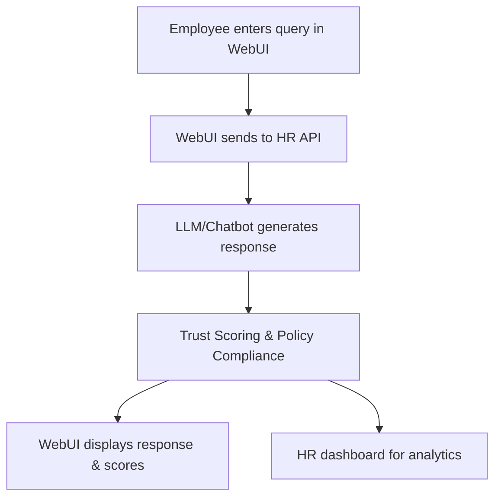

# 👩‍💼 HR SaaS Chat Support Operations – End-to-End Example

## Scenario
HR professionals and employees use the WebUI to get instant support on HR policies, payroll, and benefits via a SaaS chat system. The system ensures LLM responses are accurate, policy-compliant, and explainable.

## Step-by-Step WebUI Walkthrough
1. **Open the Unified WebUI** (`launch_workflow_webui.py`).
2. **Go to the 'HR Chat Support' page.**
3. **Enter an HR-related query** (e.g., "How do I apply for leave?").
4. **Chatbot responds with policy details or step-by-step guidance.**
5. **System evaluates trust, hallucination risk, and policy compliance.**
6. **HR dashboard shows usage analytics and flagged responses.**

## WebUI Screenshot/Mockup
```
+---------------------------------------------------+
| Employee: How do I apply for leave?               |
| Chatbot: Go to the HR portal, click 'Apply Leave' |
| Trust Score: 0.97 | Hallucination Risk: 0.03      |
| Compliance: Policy Passed                         |
+---------------------------------------------------+
```

## Flow Diagram


## Example API Call
```python
import requests
payload = {"query": "How do I apply for leave?", "employee_id": "E123"}
response = requests.post("http://localhost:8000/hr/support", json=payload)
print(response.json())
```

## Expected Outcome
```json
{
  "response": "Go to the HR portal, click 'Apply Leave', and fill out the form.",
  "trust_score": 0.97,
  "hallucination_risk": 0.03,
  "compliance": true
}
```

## Best Practices
- Keep HR policies up to date in the system.
- Use analytics to monitor support trends and flag issues.
- Ensure all responses are policy-compliant and explainable. 