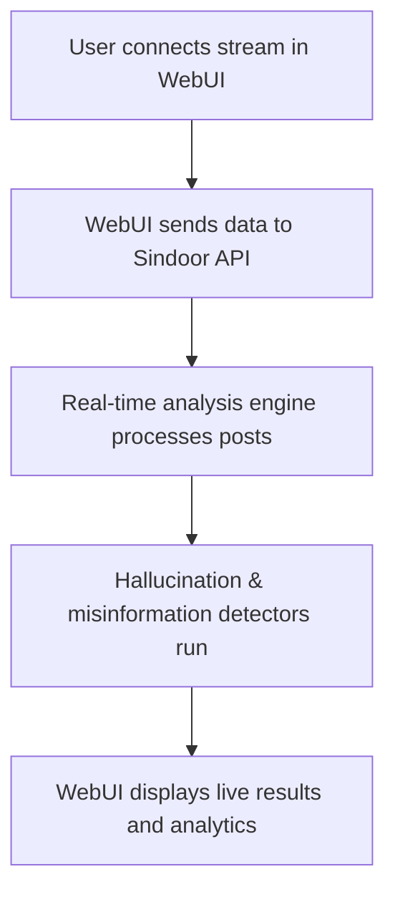

# 🕵️ Operation Sindoor – Real-Time Misinformation Detection Example

## Scenario
A fact-checking analyst uses the WebUI to detect and analyze misinformation in real-time social media streams using the Operation Sindoor workflow.

## Step-by-Step WebUI Walkthrough
1. **Open the Unified WebUI** (`launch_workflow_webui.py`).
2. **Go to the 'Operation Sindoor' dashboard.**
3. **Connect to a live social media stream or upload a batch of posts.**
4. **Click 'Start Analysis'.**
5. **View real-time results:**
   - Detected misinformation
   - Trust/risk scores
   - Source attribution
   - Timeline and trend charts

## WebUI Screenshot/Mockup
```
+---------------------------------------------------+
| [Connect Stream]  [Upload Batch]  [Start Analysis] |
+---------------------------------------------------+
| [Live Feed] [Detected Misinformation]              |
| [Trust Score Timeline] [Source Attribution]        |
+---------------------------------------------------+
```

## Flow Diagram


## Example API Call
```python
import requests
payload = {"stream_url": "https://twitter.com/hashtag/sindoor"}
response = requests.post("http://localhost:8000/operation_sindoor/analyze", json=payload)
print(response.json())
```

## Expected Outcome
```json
{
  "status": "running",
  "detected_misinformation": [
    {"post_id": "123", "risk": 0.85, "explanation": "Factually incorrect claim detected."}
  ],
  "timeline": [...],
  "attribution": {...}
}
```

## Best Practices
- Use live analysis for breaking news or trending topics.
- Review explanations and source attributions for context.
- Export reports for further investigation or public communication. 