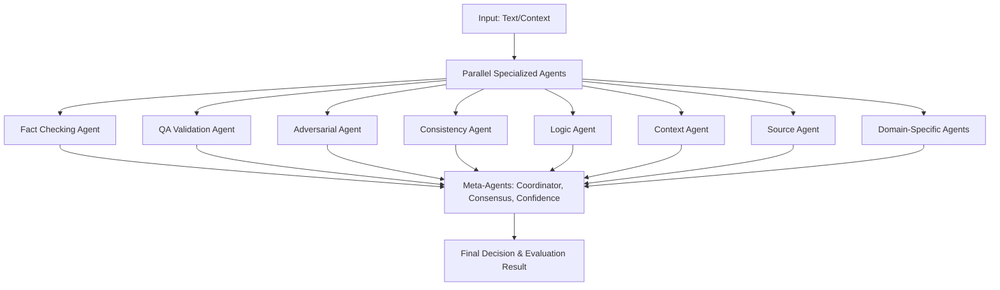

## Advanced LLaMA-Factory CLI Usage

The script `llm_engineering/scripts/phi4mini_finetune_eval_cli.py` supports all advanced LLaMA-Factory options for fine-tuning and evaluation, including:
- LoRA, QLoRA, DoRA, GaLore, LoRA+, freeze-tuning
- Quantization (AQLM, AWQ, GPTQ, LLM.int8, PTQ, QAT)
- Mixed precision, activation checkpointing, flash attention, Unsloth
- Distributed training (DeepSpeed, FSDP, NativeDDP)
- Monitors (LlamaBoard, TensorBoard, Wandb, MLflow, SwanLab)
- Adapters, custom chat templates, sequence packing
- RLHF, DPO, PPO, reward modeling
- All Trainer/Evaluator/Inferencer kwargs

### Example Usage

```bash
# Basic LoRA fine-tuning
python phi4mini_finetune_eval_cli.py --lora --batch_size 4 --epochs 3 --monitor wandb

# QLoRA with quantization and DeepSpeed
python phi4mini_finetune_eval_cli.py --qlora --quantization awq --deepspeed_config ds_config.json

# Evaluation only with experiment monitor
python phi4mini_finetune_eval_cli.py --eval_only --monitor llamaboard
```

For a full list of supported arguments and their effects, see the [LLaMA-Factory Arguments documentation](https://llamafactory.readthedocs.io/en/latest/Arguments/). 

## Dynamic Model Management CLI

The script `llm_engineering/scripts/llm_model_manager.py` allows you to add, remove, update, and list models/providers at runtime. You can also persist changes to the config file with `--persist`.

### Example Usage

```bash
# Add a model/provider
python llm_model_manager.py add --name my_llama --type llama_factory --config '{"model_name": "Llama-3-8B", "model_path": "../models/llama-3-8b"}' --persist

# Remove a model/provider
python llm_model_manager.py remove --name my_llama --persist

# Update a model/provider config
python llm_model_manager.py update --name my_llama --config '{"model_name": "Llama-3-8B-v2", "model_path": "../models/llama-3-8b-v2"}' --persist

# List all loaded models/providers
python llm_model_manager.py list
```

This enables dynamic, scriptable management of your LLM providers without editing YAML files by hand. 

## WebUI for Model Management & Tuning

The script `llm_engineering/scripts/llm_webui.py` provides a Gradio-based WebUI for dynamic model management and tuning.

### Features
- List all loaded models/providers
- Add a new model/provider (with config as JSON)
- Remove a model/provider
- Update a model/provider config
- Fine-tune a selected model/provider (with dataset and extra kwargs)
- Evaluate a selected model/provider (with dataset and extra kwargs)

### Launch

```bash
python llm_webui.py
```

This will open a browser UI for interactive model management and LLM tuning. 

## Multi-Agent System Architecture (Ground-Up, Native)

OpenTrustEval features a fully native, ground-up multi-agent system for trust evaluation, verification, and consensus. No third-party agent frameworks are used; all agent logic, orchestration, and meta-agent coordination are implemented in-house for maximum flexibility and extensibility.

### Key Features
- **Custom Python implementation**: All agent classes, coordination, and consensus logic are written natively.
- **Specialized Agents**: Fact checking, QA validation, adversarial testing, consistency, logic, context, source verification, and domain-specific agents (e.g., ecommerce, banking, legal).
- **Meta-Agents**: Coordination, consensus building, and confidence assessment.
- **Async/await orchestration**: Agents run in parallel for high throughput.
- **No external dependencies**: No use of Ray, SPADE, JADE, or other agent frameworks.

### Architecture Flow


### Data Flow
1. **Input**: Text and context are provided to the system.
2. **Parallel Agent Evaluation**: All specialized agents evaluate the input asynchronously.
3. **Meta-Agent Coordination**: Results are aggregated, consensus is built, and confidence is assessed.
4. **Final Decision**: The system outputs a comprehensive evaluation, including agent verdicts, consensus, and confidence scores.

---

## Retrieval-Augmented Generation (RAG) Architecture (Ground-Up, Native)

The RAG pipeline in OpenTrustEval is a modular, ground-up implementation. All orchestration, chunking, search, and verification logic is written natively, with pluggable interfaces for third-party models if desired.

### Key Features
- **Custom Python pipeline**: All major steps (chunking, embedding, search, re-ranking, verification) are implemented in-house.
- **Pluggable models**: Embedding generation and LLMs can use external models (e.g., Hugging Face, OpenAI), but the pipeline itself is native.
- **Hybrid search**: Combines dense, sparse, and semantic search strategies.
- **MoE (Mixture-of-Experts) verification**: Integrates with the native MoE system for domain-specific trust assessment.
- **Async/await**: High-performance, parallel processing.
- **No dependency on external RAG frameworks**: Not based on Haystack, LlamaIndex, LangChain, etc.

### Architecture Flow
```mermaid
graph TD
    A[User Query & Documents] --> B[Semantic Chunking]
    B --> C[Multi-Modal Embedding Generation]
    C --> D[Vector Store]
    D --> E[Hybrid Search (Dense/Sparse/Semantic)]
    E --> F[Context Re-Ranking]
    F --> G[MoE Verification]
    G --> H[Final Answer Generation]
    H --> I[Confidence Calculation & Output]
```

### Data Flow
1. **Semantic Chunking**: Documents are split into meaningful chunks.
2. **Embedding Generation**: Chunks are converted to embeddings (text, code, image, etc.).
3. **Vector Storage**: Embeddings are stored in a custom vector store.
4. **Hybrid Search**: User query is embedded and searched using multiple strategies.
5. **Context Re-Ranking**: Retrieved results are re-ranked for relevance.
6. **MoE Verification**: Top results are verified using the Mixture-of-Experts system.
7. **Final Answer Generation**: The system synthesizes an answer from the best results.
8. **Confidence Calculation**: Outputs include answer, supporting evidence, and confidence scores.

---

**Both the Multi-Agent and RAG systems are fully native, extensible, and designed for high performance and explainability.** 